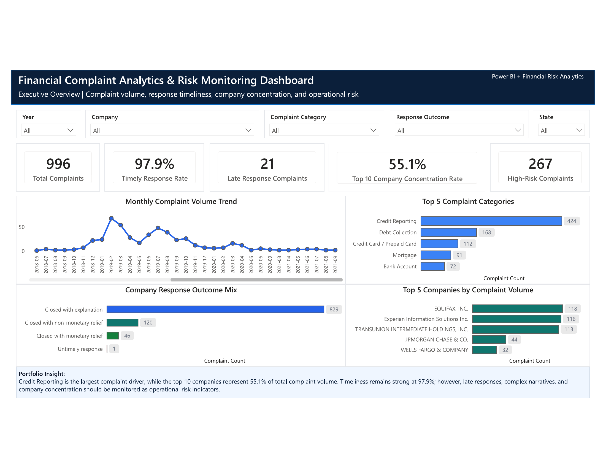
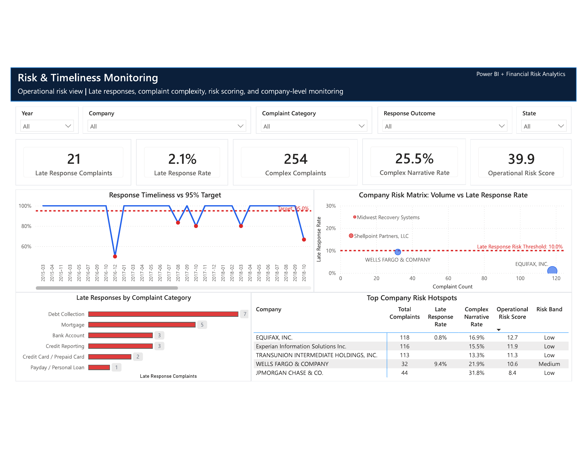
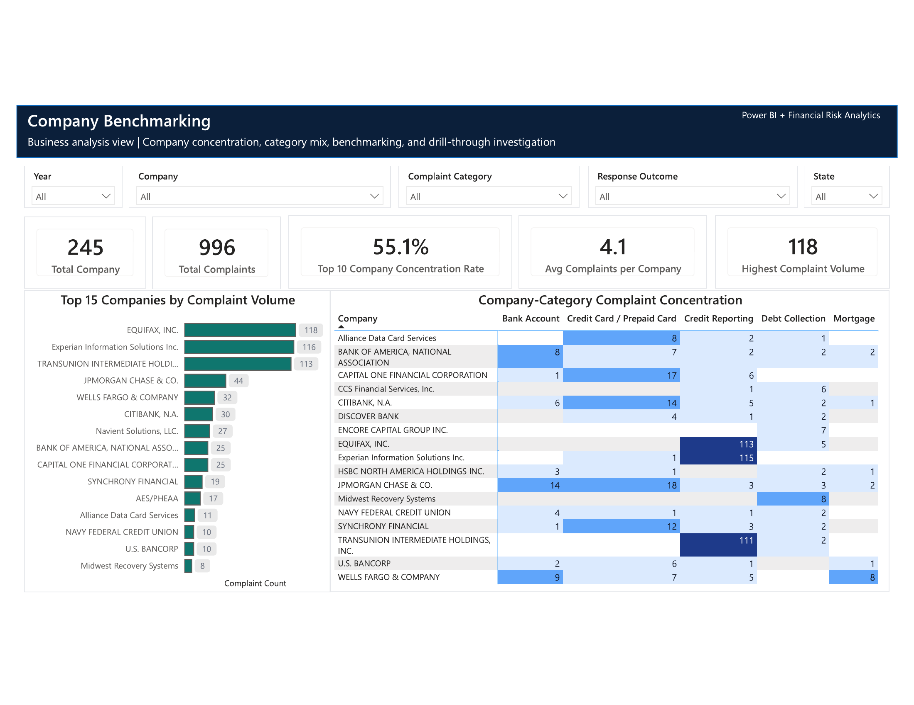
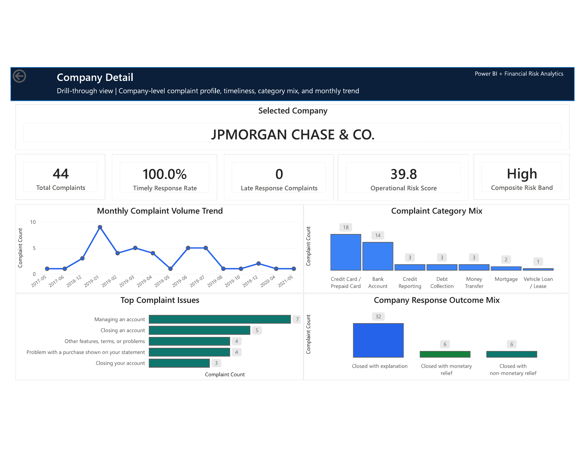
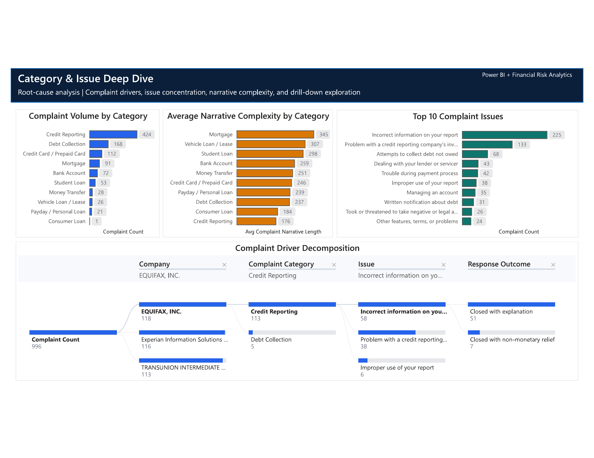
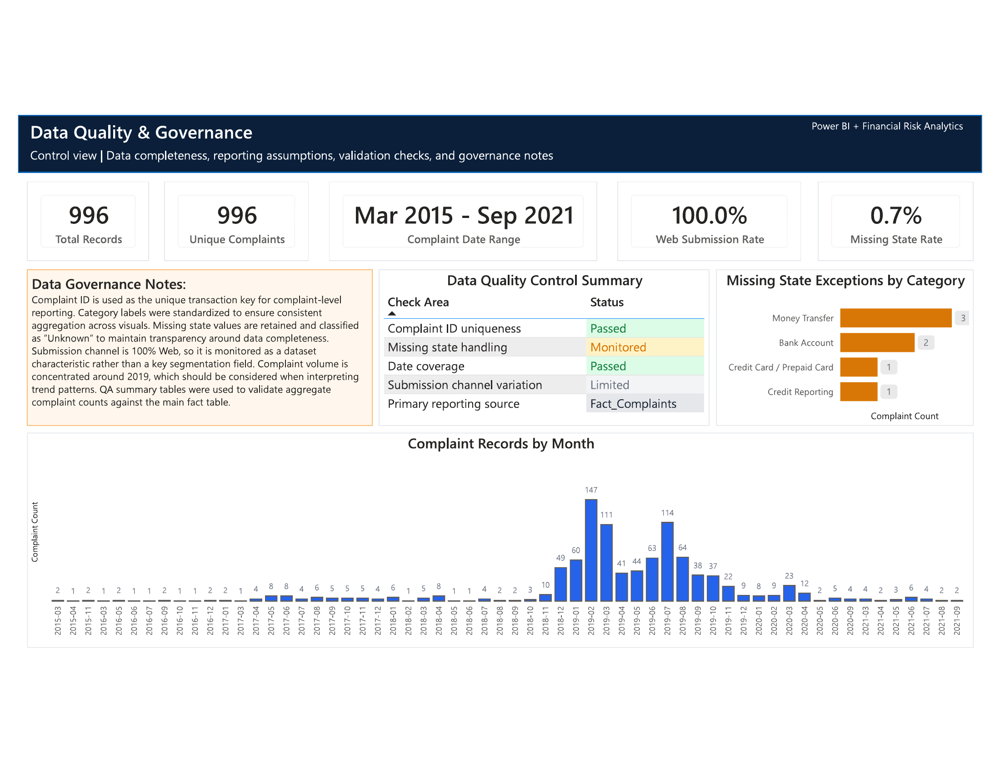
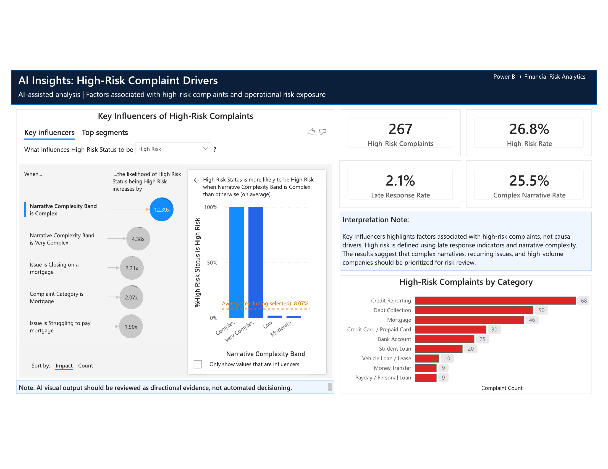

# Financial Complaint Analytics & Risk Monitoring Dashboard

> Power BI financial complaint analytics dashboard for executive reporting, operational risk monitoring, company benchmarking, drill-through analysis, and data governance.


## Recruiter Summary

This project is a **Power BI financial complaint analytics and risk monitoring dashboard** designed for complaint operations, executive reporting, data governance, and operational risk review.

The dashboard analyzes complaint volume, response timeliness, company concentration, category drivers, complex complaint narratives, high-risk complaint indicators, and data-quality controls. It demonstrates how Power BI can support financial-services teams with KPI monitoring, risk prioritization, company benchmarking, drill-through investigation, and management reporting.

This project is positioned for **finance, banking, insurance, risk, compliance, reporting, and business intelligence analyst roles in Canada**, where employers expect Power BI, DAX, Power Query, data modelling, dashboard design, governance awareness, and business communication.

> **Important positioning note:**  
> The source data contains U.S.-style state codes. This project should be presented as a **financial complaint analytics simulation adaptable to Canadian financial-services operations**, not as Canadian customer complaint data.

---

## Dashboard Preview



---

## Business Problem

Financial institutions receive complaints across products, companies, issues, locations, and response outcomes. Leaders need a reporting solution that can quickly answer:

- Which complaint categories drive the highest volume?
- Which companies have the highest complaint concentration?
- Are responses being handled on time?
- Where are late responses or complex narratives concentrated?
- Which companies or categories show elevated operational risk indicators?
- Are data-quality assumptions clear enough for finance reporting?
- Can analysts drill from portfolio-level trends into company-level root causes?

---

## Solution

This project includes a seven-page Power BI dashboard that combines executive reporting, operational risk monitoring, company benchmarking, drill-through investigation, root-cause analysis, data governance, and AI-assisted risk-driver exploration.

The report uses:

- Power Query for data cleaning, transformation, and category standardization
- Star-schema semantic modelling for scalable BI reporting
- DAX measures for KPIs, rates, rankings, concentration, and risk scoring
- Drill-through navigation for company-level investigation
- Decomposition tree analysis for complaint root-cause exploration
- Power BI Key Influencers for directional high-risk complaint insights
- Data-quality and governance documentation for auditability

---

## Key Results

| Metric | Value |
|---|---:|
| Complaint Records | 996 |
| Unique Complaints | 996 |
| Companies | 245 |
| Raw Category Keys | 11 |
| Standardized Categories | 10 |
| Timely Response Rate | 97.9% |
| Late Response Complaints | 21 |
| Late Response Rate | 2.1% |
| High-Risk Complaints | 267 |
| High-Risk Rate | 26.8% |
| Average Narrative Length | 229 words |
| Missing State Rate | 0.7% |
| Web Submission Rate | 100.0% |
| Date Range | Mar 2015 – Sep 2021 |
| Top 10 Company Concentration | 55.1% |

---

## Dashboard Pages

| Page | Purpose |
|---|---|
| **1. Executive Overview** | KPI summary, complaint trend, category drivers, top companies, response outcomes, and portfolio insight |
| **2. Risk & Timeliness Monitoring** | Late response monitoring, timeliness target tracking, operational risk score, and company-level risk matrix |
| **3. Company Benchmarking** | Company concentration, top company ranking, and company-category heatmap |
| **4. Company Detail Drill-through** | Company-specific investigation page with trend, category, issue, and response outcome analysis |
| **5. Category & Issue Deep Dive** | Category mix, narrative complexity, top issues, and decomposition tree root-cause analysis |
| **6. Data Quality & Governance** | Completeness checks, governance notes, date range, missing state review, and control summary |
| **7. AI Insights: Risk Drivers** | Power BI Key Influencers visual for directional high-risk complaint analysis |

---

## Visual Outputs

### Executive Overview


### Risk & Timeliness Monitoring



### Company Benchmarking



### Company Detail Drill-through



### Category & Issue Deep Dive



### Data Quality & Governance



### AI Insights: Risk Drivers



---

## Tools & Skills Demonstrated

| Area | Evidence |
|---|---|
| Power BI reporting | Seven-page dashboard with executive, risk, benchmarking, drill-through, category, governance, and AI insights pages |
| Power Query | Data cleaning, category standardization, missing state handling, and reporting table preparation |
| DAX | KPI measures for complaint count, timeliness, late response rate, high-risk rate, concentration, and operational risk score |
| Data modelling | Star-schema model using fact and dimension tables |
| Risk monitoring | High-risk complaint flag, late response tracking, company risk matrix, and risk-driver exploration |
| Data governance | Data-quality page, missing value handling, control notes, and QA validation |
| SQL readiness | MySQL view layer for reporting logic and validation |
| Python validation | Scripts for data validation and data profiling |
| Business communication | Executive dashboard design, screenshots, PDF report, and recruiter-ready documentation |

---

## Data Model Summary

The report uses a star-schema model with a complaint-level fact table and supporting dimensions.

```text
Dim_Date       1 ─── * Fact_Complaints
Dim_Company    1 ─── * Fact_Complaints
Dim_Category   1 ─── * Fact_Complaints
Dim_State      1 ─── * Fact_Complaints
Dim_Response   1 ─── * Fact_Complaints
Dim_Channel    1 ─── * Fact_Complaints
```

## Main KPI Logic

| KPI | Definition |
|---|---|
| Complaint Count | Distinct count of Complaint ID |
| Timely Response Rate | Timely response complaints divided by total complaints |
| Late Response Rate | Late response complaints divided by total complaints |
| Top 10 Company Concentration | Complaints from top 10 companies divided by total complaints |
| Complex Narrative Rate | Complaints with narrative length of at least 300 words divided by total complaints |
| High-Risk Complaint | Complaint with late response or complex narrative |
| Operational Risk Score | Weighted score combining complaint share, late response rate, and complex narrative rate |

---

## Data Governance Summary

- Complaint ID is used as the unique transaction key for complaint-level reporting.
- Complaint category labels were standardized to support consistent reporting and aggregation.
- Missing state values are classified as `Unknown` to preserve record completeness while making data gaps visible.
- Submission channel is 100% Web, so it is monitored as a dataset characteristic rather than used as a primary segmentation driver.
- Complaint volume is concentrated around 2019, which should be considered when interpreting trend patterns.
- QA summary tables were used to validate aggregate complaint counts against the main fact table.
- AI visual outputs are treated as directional insights and should not be interpreted as automated decisioning.

---

## Detailed Documentation

Additional project documentation is available in the `docs/` folder:

- `docs/project_overview.md`
- `docs/dashboard_design_spec.md`
- `docs/data_dictionary.md`
- `docs/data_profile.md`
- `docs/data_quality_governance.md`
- `docs/dax_measure_library.md`
- `docs/risk_scoring_logic.md`
- `docs/deployment_guide.md`
- `docs/interview_talking_points.md`
- `docs/power_query_transformation_guide.md`
- `docs/resume_bullets.md`
- `docs/sql_view_layer.md`
- `docs/data_validation_guide.md`
- `docs/repository_structure.md`

---

## How to Open the Dashboard

1. Open the Power BI report in Power BI Desktop:

```text
powerbi/financial_complaint_analytics.pbix
```

2. In Power BI Desktop, go to **Transform Data > Data source settings**.
3. Confirm that source paths point to the local `data/raw/` folder.
4. Refresh all tables.
5. Review the seven dashboard pages.
6. Use the exported PDF for quick review:

```text
reports/financial_complaint_analytics_dashboard.pdf
```

---

## How to Run Data Checks

Install requirements:

```bash
pip install -r requirements.txt
```

Run validation:

```bash
python scripts/validate_data.py
```

Generate a data profile:

```bash
python scripts/generate_data_profile.py
```

---

## Project Limitations

- This is a portfolio analytics project, not an official regulatory report.
- The source data uses U.S.-style state codes and should not be represented as Canadian customer complaint data.
- Submission channel has no variation because 100% of records are Web submissions.
- Complaint volume is concentrated around 2019, so trend interpretation should account for date distribution.
- Narrative complexity is based on word count and does not measure legal, financial, or regulatory severity directly.
- AI visual outputs are directional and should not be treated as causal proof or automated decisioning.

---

## Author

**Namarshi Palit**  
Power BI | Finance Analytics | Risk Monitoring | Data Governance
